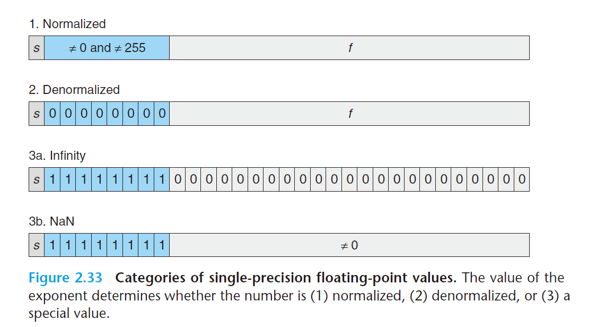

### bitXor

```C
 /* 
  * bitXor - x^y using only ~ and & 
  *   Example: bitXor(4, 5) = 1
  *   Legal ops: ~ &
  *   Max ops: 14
  *   Rating: 1
  */
```

​	本题可以通过逻辑电路的相关知识进行解题。给定不同的输入x、y，异或运算的真值表如下。

|y|x| x^y |
| :--: | :--: | :--: |
|0|0| 0 |
|1|0| 1 |
|0|1| 1 |
|1|1| 0 |

​	因此，逻辑表达式 $x \bigoplus y$ 可以表示为 $ x \bigoplus y = \overline{x} \cdot y+x \cdot\overline{y}$  。利用运算规则 $A+B=\overline{(\bar{A} \cdot  \bar{B})}$  将或运算转换为题目限制使用的的非运算和与运算，代入逻辑表示得到最终结果$x \bigoplus y =\bar{x} \cdot y+x \cdot \bar{y}=\overline{(\overline{(\bar{x} \cdot y)}) \cdot (\overline{(x \cdot \bar{y})})}$ 将最终结果转换为对应的逻辑符号即`x ^ y=~(~(~x & y) & ~(x & ~y))`。实现如下：	
```C
int bitXor(int x, int y) { 
/* transfer problem into exploit Xor gate by using and gate and not gate*/    
	int result = ~(~(~x & y) & ~(x & ~y));    
	return result;  
}
```


### **tmin**

```C
/*   
 * tmin - return minimum two's complement integer   
 *   Legal ops: ! ~ & ^ | + << >>  
 *   Max ops: 4  
 *   Rating: 1  
 */
```

​	根据补码的定义，符号位为1则为最小的补码数，因此对常数1直接移位即可实现。

```c
int tmin(void) {   
/* implement tmin by shifting 1 with 31 times */  
	return 1 << 31; 
}
```


### **isTmax**

```C
/*
 * isTmax - returns 1 if x is the maximum, two's complement number,
 *     and 0 otherwise 
 *   Legal ops: ! ~ & ^ | +
 *   Max ops: 10
 *   Rating: 1
 */
```


​		逻辑运算符异或（^）具有判定集合之间symmetric difference的作用，因此采用异或运算符判定输入。步骤如下：~~

- ~~构造Tmax~~
- ~~采用异或判定~~

```c
int isTmax(int x) {
    /* exploit symmetric difference ability of Xor to detect number */
  return !(~(1 << 31) ^ x);
}
```


​	上述思路使用了非法的移位的运算符因此修正思路为通过Tmax构造去构造出0来检测出Tmax(这里利用有符号数的溢出，不过C++标准中有符号数的溢出是未定义行为，但是想不出其他方法了，实际生产中谨慎使用)，此处还参考了[博客](https://claude-ray.com/2019/10/02/csapp-datalab/) 的实现。


### **allOddBits**

```c
/* 
 * allOddBits - return 1 if all odd-numbered bits in word set to 1
 *   where bits are numbered from 0 (least significant) to 31 (most significant)
 *   Examples allOddBits(0xFFFFFFFD) = 0, allOddBits(0xAAAAAAAA) = 1
 *   Legal ops: ! ~ & ^ | + << >
 *   Max ops: 12
 *   Rating: 2
 */
```

​	思路同3中第一部分，步骤如下

- 构造0xAAAAAAAA
- 异或判定

```C
int allOddBits(int x) {
    /* detect symmertric difference by using mask 0xAAAAAAAA */
    int mask = 0xAA;
    int result; // should declare in front, otherwise dlc report comppilation error
    mask = mask + (mask << 8) +(mask << 16) + (mask << 24); // construct mask
    result  = !((x & mask) ^ mask);
  return result;
}
```


### **negate**

```C
/* 
 * allOddBits - return 1 if all odd-numbered bits in word set to 1
 *   where bits are numbered from 0 (least significant) to 31 (most significant)
 *   Examples allOddBits(0xFFFFFFFD) = 0, allOddBits(0xAAAAAAAA) = 1
 *   Legal ops: ! ~ & ^ | + << >>
 *   Max ops: 12
 *   Rating: 2
 */
```

​	由二进制补码表示的规则可知x与~x的和为-1，即x+~x=-1，移项后的-x=~x+1

```C
int negate(int x) {
    /* reverse every bit then plus one */
  return ~x + 1;
}
```

### **isAsciiDigit**

```C
 * isAsciiDigit - return 1 if 0x30 <= x <= 0x39 (ASCII codes for characters '0' to '9')
 *   Example: isAsciiDigit(0x35) = 1.
 *            isAsciiDigit(0x3a) = 0.
 *            isAsciiDigit(0x05) = 0.
 *   Legal ops: ! ~ & ^ | + << >>
 *   Max ops: 15
 *   Rating: 3
 */

```

​	可以将本题的不等式 0x30 <= x <= 0x39 转换为两个不等式 x-0x30 >=0 和 0x39-x >=0，并且同时满足。转换为大于等于0的目的在于：可以通过简单的判断符号位是否为0确定一个数是否大于等于0。因此只需要计算x-0x30和0x39-x的符号位。

```C
int isAsciiDigit(int x) {
    /* decompose inequlity into x-0x30 >=0 and 0x39-x >=0 and compute intersection */
    int TMin = 1 << 31;
    int lowerBound = !((x + ~0x30 + 1) & TMin);
    int upperBound = !((~x + 1 + 0x39) & TMin);
    int result = lowerBound & upperBound;
  return result;
}
```

### **conditional**

```C
/* 
 * conditional - same as x ? y : z 
 *   Example: conditional(2,4,5) = 4
 *   Legal ops: ! ~ & ^ | + << >>
 *   Max ops: 16
 *   Rating: 3
 */
```


​	要想实现类型?:运算符的效果，就得使得当x的位表示中任意一位为1表示为统一的一个状态，位表示全为0表示为一个状态。实现这一功能需要运用要逻辑运算符！，当任意一位为1时！运算得到False，对应的真值0。全为0时运算得到True，对应的真值为1。

​	接下来考虑如果在不同x的表示时输出y和z，由于我们只能运用到！这一逻辑运算符，因此在表达式中会同时运用到y和z，却又需要根据x的不同分别输出y和z。根据这一点联想到需要运用0x00000000进行与运算实现“屏蔽”效果，0xFFFFFFFF进行与运算实现“输出”效果，然后对结果取并集。对被“屏蔽”的值取并集不影响最后的结果。

​	最后需要考虑如何将True、False或者0、1与0x00000000、0xFFFFFFFF这几个值关联起来，补码表示法中，这里0和0x00000000是等价的，都表示10进制中的0。0xFFFFFFFF为十进制的-1。因此关联这些值的方法就是取相反数，即位运算先取反后加一。

总结如下：

当x的位表示中任意一位为1

- !!运算得到True（真值为1）
- 取反加一得到0xFFFFFFFF

当x的位表示中全为0

- !!运算得到False（真值为0）
- 取反加一得到0x00000000

```C
int conditional(int x, int y, int z) {
    /* use bitsign 0xFFFFFFFF、0x00000000 implement output and block */
    int logicSign = !!x; // any bit is one, logicsign equals True. Otherwise False. 
    int bitSign  = ~logicSign + 1; // True turn into bit sign 0xFF..FF. False into 0x0.
    int result = (bitSign & y) | (~bitSign & z);
  return result;
}
```


### **isLessOrEqual**

```C
/* 
 * isLessOrEqual - if x <= y  then return 1, else return 0 
 *   Example: isLessOrEqual(4,5) = 1.
 *   Legal ops: ! ~ & ^ | + << >>
 *   Max ops: 24
 *   Rating: 3
 */
```

​	题目需要判定大小关系又不能使用比较运算符，唯一的办法只能通过补码表示法的符号为去判别大小关系，补码表示中符号位为1则表示值小于0，符号位为0则表示值大于等于0。因此构造表达式 y-x >= 0。

```C
int isLessOrEqual(int x, int y) {
    /* detect less or equal by sign bit */
    int sign = 1 << 31;
    int result = !((y +(~x + 1)) & sign); // fetch sign bit and calculate
  return result;
}
```


### **logicalNeg**

```C
/* 
 * logicalNeg - implement the ! operator, using all of 
 *              the legal operators except !
 *   Examples: logicalNeg(3) = 0, logicalNeg(0) = 1
 *   Legal ops: ~ & ^ | + << >>
 *   Max ops: 12
 *   Rating: 4 
 */
```

​	本题的要点在于如何区别0x00000000，和 0x10000000,其他数。这里需要使用到补码表示的二进制数的相反数，0的相反数为0，TMin的相反数TMin，其余的数x的相反数为-x。

​	0与0的并集 相比TMin与TMin的并集、x与-x的并集三者的差别在于符号32位补码表示下，前者符号位为0后者符号为1。于是利用这点对并集进行算术右移，前者右移的结果保持为0后者结果为-1（0xffffffff），将结果+1得到最终答案。

```C
int logicalNeg(int x) {
    /* use the property of difference between the opposite of zero , TMin , and the others. */
    int bitUnion = (x | (~x + 1)); // x=0,-x=0; x=TMin,-x=TMin;x=the others, -x=-the others, compute their union by using | operator.
    int result = (bitUnion >> 31) + 1; //  use arithmetic right shift to detect 0x00000000.
  return result;
}
```


### howManyBit

```c
/* howManyBits - return the minimum number of bits required to represent x in
 *             two's complement
 *  Examples: howManyBits(12) = 5
 *            howManyBits(298) = 10
 *            howManyBits(-5) = 4
 *            howManyBits(0)  = 1
 *            howManyBits(-1) = 1
 *            howManyBits(0x80000000) = 32
 *  Legal ops: ! ~ & ^ | + << >>
 *  Max ops: 90
 *  Rating: 4
 */
```

​	本题参考[博客](https://zhuanlan.zhihu.com/p/59534845)的思路，利用二分法进行检测。如果int的机器表示中高16位中存在任一位的1，即代表至少需要低位的16位来表示这个数，从而移位掉低位然后利用二分法继续检测剩下的16位。反之，如果高位中不存在，则无需以为移位继续对低位重复操作。

​	利用逻辑符号！将是否存在有效位转换为1和0实现对低位移除是是与否。

```c
int howManyBits(int x) {
    /* use bisection method to detect whether section exist at each time */
    int signBit = x >> 31;
    int exist16Bits, exist8Bits, exist4Bits, exist2Bits, exist1Bits;
    int result;
    x = x ^ signBit; // use Xor operator to implement negation or maintain (x ^ 1 negation x ^ 0 maintain)

    exist16Bits =  !!(x >> 16) << 4; // Bisection, if high 16BitExist, exist16Bits = 1 << 4 = 16, otherwise 0.
    x = x >> exist16Bits; // if high 16bits exist, remove lower 16bits and keep detecting, otherwise don't shift.
    exist8Bits = !!(x >> 8) << 3;
    x = x >> exist8Bits;
    exist4Bits = !!(x >> 4) << 2;
    x = x >> exist4Bits;
    exist2Bits = !!(x >> 2) << 1;
    x = x >> exist2Bits;
    exist1Bits = !!(x >> 1) << 0;
    x = x >> exist1Bits;

    result = x + exist1Bits + exist2Bits + exist4Bits + exist8Bits + exist16Bits + 1; // finally we need msb bit to represent sign, so +1.
  return result;
}
```


------

浮点数的实现大多数依赖如下图示：



### floatScale2

```c
//float
/* 
 * floatScale2 - Return bit-level equivalent of expression 2*f for
 *   floating point argument f.
 *   Both the argument and result are passed as unsigned int's, but
 *   they are to be interpreted as the bit-level representation of
 *   single-precision floating point values.
 *   When argument is NaN, return argument
 *   Legal ops: Any integer/unsigned operations incl. ||, &&. also if, while
 *   Max ops: 30
 *   Rating: 4
 */
```
本题进行分类讨论即可，IEEE 745表示的浮点数为V=M*2^E，对于Denormalized数，由于定义上exp部分就固定为0，因此只能对其frac部分进行运算，加上其本身即可。对于Normalized数，由于其frac部分隐含者前置的1，所以无法通过frac实现，对其exp加上1即可。其余的Infinity和NaN直接返回即可。

```C
unsigned floatScale2(unsigned uf) {
    /* implement expression by manipulating exponent bits and fraction bits */
    unsigned expBits = (uf >> 23) & 0x000000FFu;
    unsigned fracBits = uf & 0x007FFFFFu;

    if(expBits == 0xFF) return uf; // uf is NAN or infinite
    else if(expBits == 0x00 && fracBits == 0x00) return uf; // when f = 0, 2 * 0 = 0, return uf

    if(expBits == 0x00) return uf + fracBits; // denormalize number, can only manipulate fraction to imlement x2.
    else return uf + (1 << 23); // normalized number, due to the leading 1 in frac, can only manipulate exponent to implement x2 
}
```


### floatFloat2Int

```c
/* 
 * floatFloat2Int - Return bit-level equivalent of expression (int) f
 *   for floating point argument f.
 *   Argument is passed as unsigned int, but
 *   it is to be interpreted as the bit-level representation of a
 *   single-precision floating point value.
 *   Anything out of range (including NaN and infinity) should return
 *   0x80000000u.
 *   Legal ops: Any integer/unsigned operations incl. ||, &&. also if, while
 *   Max ops: 30
 *   Rating: 4
 */
```

​	将float转换成对应的int只需要记住float的表示方法。先取出三个部分exp,frac,signbit。

​	对于Normalized数，首先加上前置的1，即表示1.frac。然后分类讨论E大小，如果E在[-126, -1]里，代表的数整数部位分为0，小数部分转换成正数后就会全部截断，因此返回0即可。E在[0, 23],frac部分要右移移掉多出的部分。如果是[24, 30],对1.frac进行左移即可，如果超出30，所表示的正数超过TMax，返回0x80000000即可。对于要转换的负数，我们按照上述同样的规则表示其绝对值，然后利用取反再加1得到对应的负数。

​	对于Denormalized数，由于其所表的数在(-1,1)内，于是直接返回0即可。

```c
int floatFloat2Int(unsigned uf) {
    /* transfer float by manipulate exponent and fraction */

    unsigned expBits = (uf >> 23) & 0x000000FFu;
    unsigned fracBits = uf & 0x007FFFFFu;
    unsigned signBit = (uf >> 31) & 0x1u;
    unsigned Bias = 127; // 2 ^ (k-1) - 1 = 12
    unsigned normE; // normalized number's E, E = exp - Bias
    unsigned normM; // normalized number's M, M = 1.frac

    if(expBits == 0xFF) return 0x80000000; // uf is NaN or infinity
    else if(expBits == 0x00) return 0;   // denormalized, return 0

    /* normalized number*/
    // constrcut exp <= Bias - 1 to avoid representing negative number
    if(expBits <= Bias - 1) return 0; // normalized, exp-Bias <= -1, number < 1, so return 0. 
    normE = expBits - Bias;
    normM = (1 << 23) + fracBits;   // add the leading 1.   
    if(normE <= 23)
    {
        if(!signBit)
            return normM >> (23 - normE); // normlized norm <= 23, positive number 
        else
            return ~(normM >> (23 - normE)) + 1; // negative number
    }
    if(normE >= 24 && normE <= 30)
    {
        if(!signBit)
            return normM << (normE - 23); // positive number
        else
            return ~(normM << (normE -23)) + 1;
    }
    // normE >= 31, 32bit int can not represent anymore. 
    // includ TMIN, correspend representation happend to be 0x80000000
    return 0x80000000u;
}
```


### floatpower2

```C
/* 
 * floatPower2 - Return bit-level equivalent of the expression 2.0^x
 *   (2.0 raised to the power x) for any 32-bit integer x.
 *
 *   The unsigned value that is returned should have the identical bit
 *   representation as the single-precision floating-point number 2.0^x.
 *   If the result is too small to be represented as a denorm, return
 *   0. If too large, return +INF.
 * 
 *   Legal ops: Any integer/unsigned operations incl. ||, &&. Also if, while 
 *   Max ops: 30 
 *   Rating: 4
 */


```

​	当x的值在[-126, 127]值，正好就是Normalized的表示范围，相当于frac部分全为零，通过所给E构造Exp即可。由于Denormalized的frac部分没有前置的1，因此frac部分可以进一步表示x的值，但是此时只能有且只有一个1。

>  假设有两个，那么$(2^x+2^y)2^{-126}$此时$x$与$y$不相等，无法全部与$2^{-126}$合并同类项，会留出一个余数在前即，但是题目只能是$2.0^{x}$

frac一共有23位，所以可以最多表示到-149次方。

​	其余超出这个范围的指数都无法表示。

```C
unsigned floatPower2(int x) {
    /* transfer expression 2.0 ^ x by manipulating frac and exp */
    int Bias = 127;
    int posINF = 0x7F800000;
    unsigned V = 0;
    unsigned expBits;
    unsigned fracBits; // all number all positive, don't need neg sign bit

    //signle-prescision can represent  2.0^x ,which x locate in [-149, 127]

    if(x >= -126 && x <= 127) // normal number
    {
        expBits = x + Bias; // all the result are postive, int/unsign can savely transfer.
        return expBits << 23;
    }
    else if(x < -126 && x >= -149) // denorm number
    {
        fracBits = 0x1 << (x - (-149));
        return fracBits;
    }

    if(x > 127) return posINF; // too large, larger than what normal number exp can represent 
    else if(x < -149) return 0; // too small, smaller than what denorm can represent, frac can provide extral 23, which is LSB=1 
}
```


